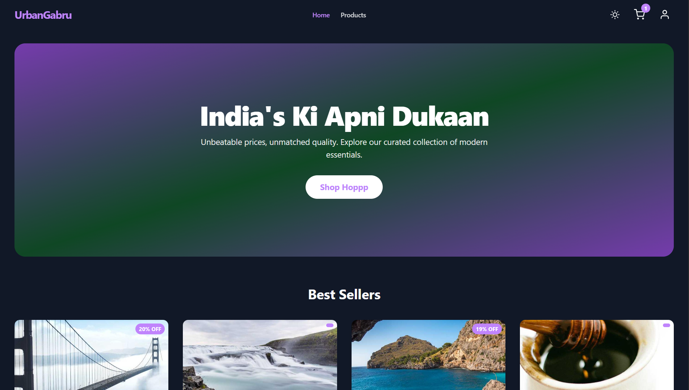
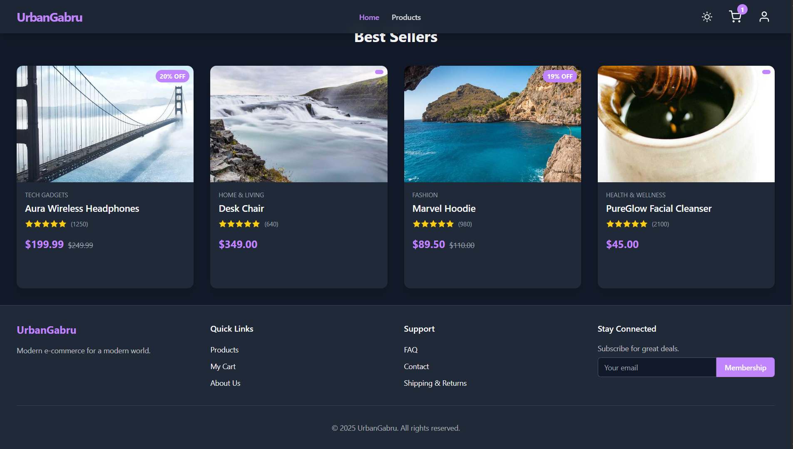
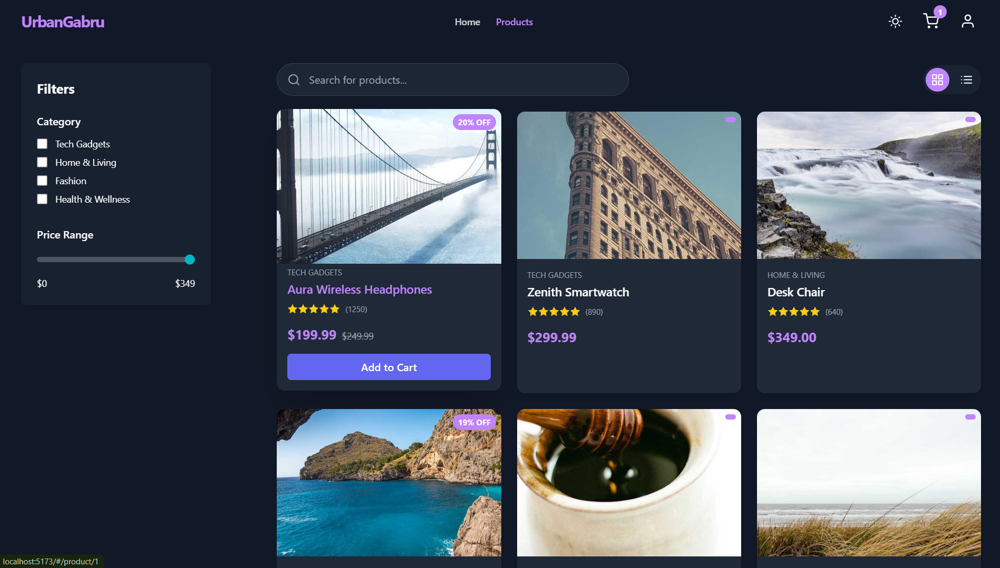
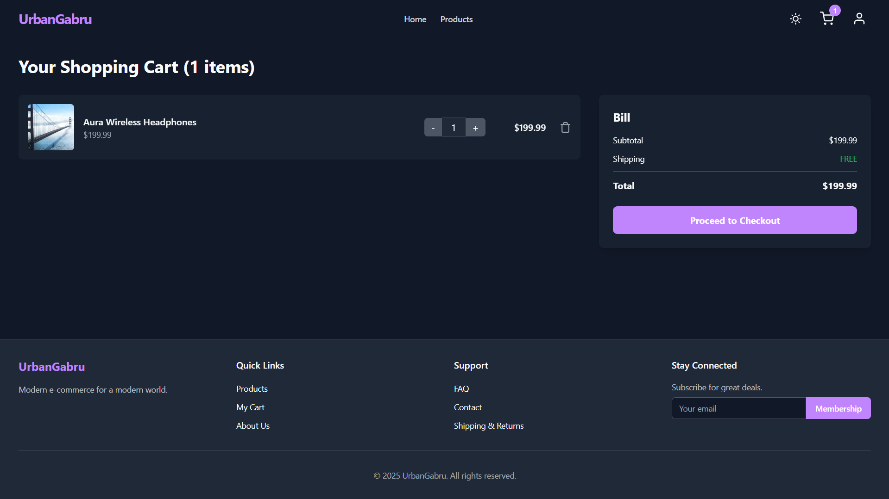
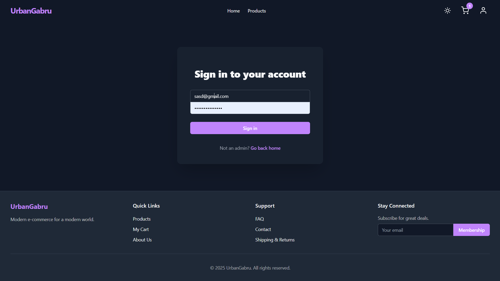

# Modern E-Commerce Platform


`UrbanGabru` is a feature-rich, modern e-commerce web application built with React, TypeScript, and Tailwind CSS. It boasts a unique, responsive UI with glassmorphism design elements, smooth animations, and a seamless user experience. The application supports both customer and admin roles, providing a complete solution for a modern online store, all running in a build-less, browser-native environment.

---

## ✨ Key Features

### General
-   🎨 **Stunning UI/UX**: A unique, non-standard layout that is both beautiful and intuitive.
-   📱 **Fully Responsive**: Flawless experience on mobile, tablet, and desktop.
-   💎 **Glassmorphism Design**: Modern, semi-transparent elements with smooth animations and clean typography.
-   🌗 **Dark/Light Mode**: Seamless theme switching for user preference.
-   🔐 **Role-Based Access**: Simulated authentication system for `Admin` and `User` roles.
-   🧭 **Client-Side Routing**: Fast and smooth navigation powered by React Router.

### User / Customer Features
-   ✅ **Login System**: Secure entry point for users (Admin login implemented).
-   🛍️ **Product Listings**: Browse products with a toggleable **Grid View** and **List View**.
-   🔍 **Search & Filter**: Easily find products with a powerful search bar and filters for category and price.
-   📦 **Product Detail Page**: Rich product pages with multiple images, detailed descriptions, ratings, and stock levels.
-   🛒 **Shopping Cart**: Fully functional cart to add items, update quantities, and remove products.
-   📋 **(Foundation for)**: Wishlist, multi-step checkout, order history, and more.

### Admin Features
-   🔑 **Admin Login**: Separate, secure login for administrators.
-   ⚙️ **Protected Dashboard**: An exclusive dashboard accessible only to authenticated admins.
-   📊 **(Foundation for)**: Sales statistics, product management (add/edit/delete), order management, and user oversight.

---
## 📸 UI







## 🛠️ Tech Stack & Libraries

-   **Framework**: [React 18](https://reactjs.org/)
-   **Language**: [TypeScript](https://www.typescriptlang.org/)
-   **Styling**: [Tailwind CSS](https://tailwindcss.com/) (via CDN)
-   **Routing**: [React Router](https://reactrouter.com/)
-   **State Management**: React Context API & Hooks
-   **Icons**: Custom-built SVG components for performance and scalability.
-   **API Layer**: Mock API service to simulate backend interactions without a server.

---

### Running the Application

1.  **Clone the Repository**
    ```bash
    git clone https://github.com/y/elegance-ecommerce.git
    cd elegance-ecommerce
    ```

2.  **Serve the Project**
    You can serve the `index.html` file using any simple local web server.

    **Using `live-server` (if you have Node.js):**
    ```bash
    npx live-server .
    ```

    **Using Python's built-in server:**
    ```bash
    # For Python 3
    python -m http.server
    ```

3.  **Open in Browser**
    Navigate to the local URL provided by your server (e.g., `http://127.0.0.1:8080` or `http://localhost:8000`).


## 🧑‍💻 Admin Access

To explore the admin-specific features, navigate to the login page and use the following hardcoded credentials:

-   **Email**: `admin@elegance.com`
-   **Password**: `admin123`

---

## 📁 File Structure

The project maintains a clean and organized file structure for scalability and maintainability.

```
.
├── index.html          # Main HTML entry file
├── index.tsx           # React application entry point
├── App.tsx             # Root component with routing setup
├── types.ts            # TypeScript type definitions
├── constants.tsx       # Shared constants like icons and categories
├── metadata.json       # Application metadata
├── README.md           # You are here!
├── services/
│   └── mockApi.ts      # Mock API for fetching product data
├── context/
│   └── AppContext.tsx  # Global state management (theme, cart, auth)
├── hooks/
│   └── useAppContext.ts # Custom hook for easy context access
├── components/
│   ├── Header.tsx
│   ├── Footer.tsx
│   ├── ProductCard.tsx
│   ├── SearchBar.tsx
│   ├── FilterSidebar.tsx
│   ├── QuantitySelector.tsx
│   ├── CartItem.tsx
│   └── ProtectedRoute.tsx # Guards routes for authenticated users
└── pages/
    ├── HomePage.tsx
    ├── ProductsPage.tsx
    ├── ProductDetailPage.tsx
    ├── CartPage.tsx
    ├── LoginPage.tsx
    ├── AdminPage.tsx
    └── NotFoundPage.tsx
```
